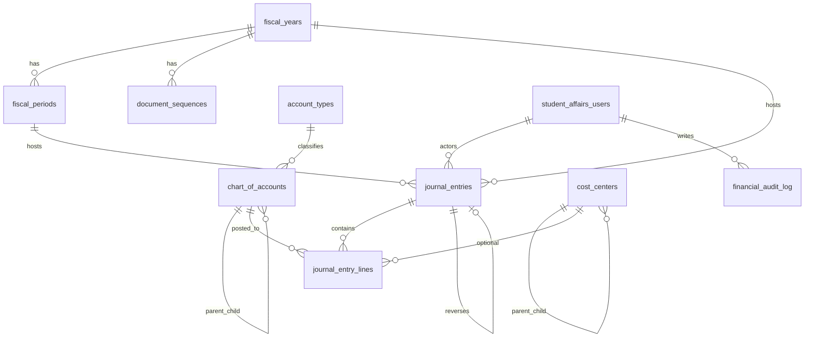
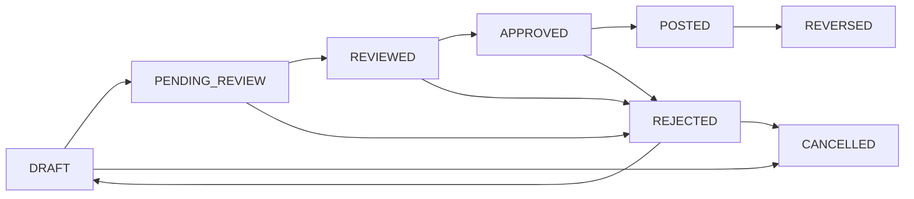
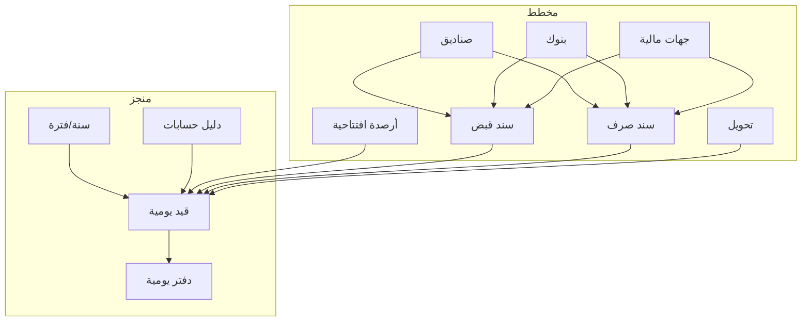
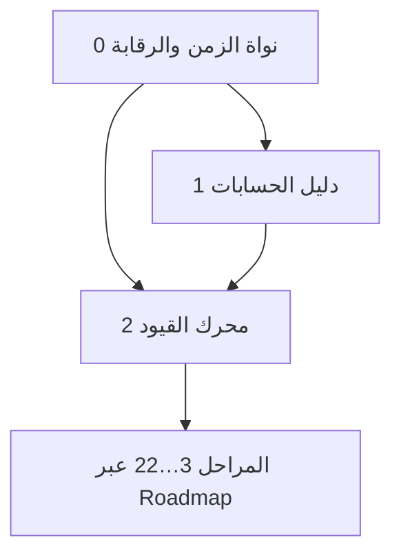
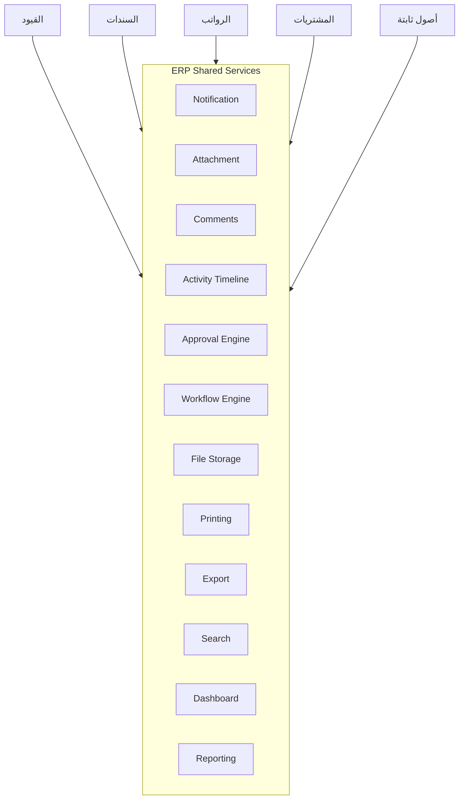

# وثيقة معمارية مؤسسية — نظام الحسابات
## Enterprise ERP Architecture Document  
### كلية الشرق التقنية التخصصية — منصة systimit

| الحقل | القيمة |
|--------|--------|
| **الإصدار** | 2.0 (Enterprise) |
| **التاريخ** | 12 تموز 2026 |
| **الحالة** | مرجع رسمي معتمد — محرك الحسابات Baseline `accounting-engine-v1` (حتى نهاية المرحلة 2) |
| **النطاق** | تصميم معماري فقط — بلا كود وبلا migrations في هذه الوثيقة |
| **السوابق** | المرحلة 0 (نواة) · المرحلة 1 (دليل الحسابات) · المرحلة 2 (محرك القيود) |
| **الوسم** | `accounting-engine-v1` |
| **وثائق مرافقة معتمدة** | مواصفة الصناديق v1.1 · Design Review · Acceptance Criteria v1.0 · مذكرة الإصدار |

هذه الوثيقة هي **المصدر المعماري المعتمد** لتطوير نظام الحسابات والوحدات المالية المرتبطة به خلال السنوات القادمة. أي تنفيذ لاحق يجب أن يلتزم بها أو يحدّثها بقرار صريح قبل كسر قواعدها.

### مجموعة الوثائق الرسمية المعتمدة (حزمة المرحلة 2 → بوابة المرحلة 3)

| الوثيقة | المسار | الدور |
|---------|--------|--------|
| ERP Architecture | [`docs/accounts-erp-architecture.md`](./accounts-erp-architecture.md) | المرجع المعماري الأعلى |
| Cash Management Design Specification v1.1 | [`docs/cash-management-design-specification.md`](./cash-management-design-specification.md) | مواصفة تصميم المرحلة 3 |
| Cash Management Design Review | [`docs/cash-management-design-review.md`](./cash-management-design-review.md) | اعتماد المراجعة المعمارية |
| Cash Management Acceptance Criteria v1.0 | [`docs/cash-management-acceptance-criteria.md`](./cash-management-acceptance-criteria.md) | معايير قبول المرحلة 3 |
| Release: accounting-engine-v1 | [`docs/releases/accounting-engine-v1.md`](./releases/accounting-engine-v1.md) | Baseline مستقر قبل المرحلة 3 |

---

## فهرس المحتويات

1. ملخص النظام  
2. المراحل المنجزة  
3. مخطط قاعدة البيانات الحالي  
4. جداول schema `accounts`  
5. العلاقات بين الجداول  
6. دورة القيود المحاسبية  
7. حالات القيود وانتقالاتها  
8. دورة المستندات المالية  
9. قواعد العمل (Business Rules)  
10. ترقيم المستندات  
11. مخطط الوحدات الحالية  
12. الوحدات المستقبلية (ملخص)  
13. اعتماد المراحل على بعضها  
14. واجهات النظام الحالية  
15. APIs الحالية  
16. Helpers الحالية  
17. القرارات التقنية المعتمدة  
18. ما يجب عدم كسره  
19. الخدمات المشتركة للنظام (ERP Shared Services)  
20. معايير التطوير (Coding Standards)  
21. تاريخ إصدارات قاعدة البيانات  
22. التكاملات المستقبلية  
23. خارطة الطريق النهائية (ERP Roadmap)  
24. المبرر المعماري لترتيب المراحل  
25. إدارة الوثيقة والتغيير  

---

# الجزء أ — الوضع الحالي للنظام

## 1. ملخص النظام

نظام الحسابات وحدة مالية داخل منصة `systimit` (Next.js + PostgreSQL + JWT)، مخصّصة لكلية الشرق التقنية التخصصية.

**الهدف الاستراتيجي:** بناء دفتر محاسبي مزدوج القيد يدعم العمليات المالية للكلية (أقساط، رواتب، صناديق، بنوك، موردون، أصول…) مع فصل صارم بين:

| الطبقة | الدور |
|--------|--------|
| الهيكل (Schema) | الجداول والقيود في `accounts.*` |
| القواعد (Business Rules) | التحقق في الخادم داخل معاملات |
| الخدمات المشتركة | إشعارات، مرفقات، موافقات، تقارير… |
| الواجهة | إدخال ومراجعة وتقارير |
| التكامل | مصادر تشغيلية تولّد قيوداً عبر `source_type` / `source_id` |

**المبادئ الحاكمة:**
- Schema مستقل: جداول `accounts.*` مؤهّلة بالكامل
- الحماية بنظام `ACCOUNTS` عبر JWT (مع قابلية صلاحيات تفصيلية لاحقاً)
- لا أرصدة مخزّنة داخل دليل الحسابات؛ الأرصدة تُحسب من القيود المرحلة
- الأموال بـ `NUMERIC(18,3)` وليس float
- كل تغيير مالي جوهري داخل Transaction + تدقيق

---

## 2. المراحل المنجزة

| المرحلة | المحتوى | Migrations | الحالة |
|---------|---------|------------|--------|
| **0** | السنوات، الفترات، مراكز الكلفة، تسلسل المستندات، التدقيق، الإعدادات | 058 | معتمدة |
| **1** | أنواع الحسابات، دليل الحسابات، شجرة الكلية، seed آمن، المصدر والترتيب | 059, 060 | معتمدة (commit `80ecb98`) |
| **2** | القيود المزدوجة، دورة الاعتماد/الترحيل، العكس، دفتر اليومية الأساسي | 061 | منفّذة ومعتمدة وظيفياً |

**ما لم يُنجز بعد (متعمداً):** الصناديق، البنوك، الجهات المالية، الأرصدة الافتتاحية من الواجهة، السندات، التحويلات، التقارير المالية الرسمية، ربط الأقساط/الرواتب محاسبياً، الأصول، الإقفال، الموازنات.

---

## 3. مخطط قاعدة البيانات الحالي (منطقي)



---

## 4. جداول schema `accounts`

### 4.1 نواة الزمن والرقابة (058)
| الجدول | الغرض |
|--------|--------|
| `fiscal_years` | السنة المالية (DRAFT / ACTIVE / CLOSED) |
| `fiscal_periods` | الفترات (OPEN / CLOSED / LOCKED) |
| `cost_centers` | مراكز الكلفة الشجرية (`is_group`؛ بدون `allow_posting` حالياً) |
| `document_sequences` | ترقيم المستندات لكل سنة ونوع |
| `financial_audit_log` | تدقيق مالي غير قابل للتعديل من الواجهة |

### 4.2 دليل الحسابات (059 + 060)
| الجدول | الغرض |
|--------|--------|
| `account_types` | ASSET / LIABILITY / EQUITY / REVENUE / EXPENSE |
| `chart_of_accounts` | الشجرة + `source` (SYSTEM/USER) + `sort_order` |

### 4.3 محرك القيود (061)
| الجدول | الغرض |
|--------|--------|
| `journal_entries` | رأس القيد + دورة الحياة + العكس + `version` |
| `journal_entry_lines` | سطور المدين/الدائن |

**المجموع الحالي:** 9 جداول محاسبية أساسية في `accounts`.

---

## 5. العلاقات بين الجداول

| من | إلى | القاعدة |
|----|-----|---------|
| `fiscal_periods.fiscal_year_id` | `fiscal_years` | RESTRICT |
| `document_sequences.fiscal_year_id` | `fiscal_years` | CASCADE مع السنة |
| `chart_of_accounts.account_type_id` | `account_types` | RESTRICT |
| `chart_of_accounts.parent_id` | `chart_of_accounts` | RESTRICT |
| `cost_centers.parent_id` | `cost_centers` | RESTRICT |
| `journal_entries.fiscal_year_id` | `fiscal_years` | RESTRICT |
| `journal_entries.fiscal_period_id` | `fiscal_periods` | RESTRICT |
| `journal_entries.reverses/reversal_entry_id` | `journal_entries` | RESTRICT |
| `journal_entry_lines.journal_entry_id` | `journal_entries` | CASCADE |
| `journal_entry_lines.account_id` | `chart_of_accounts` | RESTRICT |
| `journal_entry_lines.cost_center_id` | `cost_centers` | RESTRICT |
| حقول المستخدمين | `student_affairs.users` | مرجع خارجي |

---

## 6. دورة القيود المحاسبية



- الترحيل يعيد التحقق من السطور والحسابات والسنة/الفترة والتوازن داخل Transaction مع قفل رأس القيد.
- **لا جدول أرصدة مخزّن:** الأثر المالي = مجموع سطور القيود ذات `status = POSTED`.
- العكس = قيد `REVERSAL` جديد مرحّل فوراً، مع ربط الأصل.

---

## 7. حالات القيود وانتقالاتها

| الحالة | المعنى | تعديل مباشر؟ |
|--------|--------|----------------|
| DRAFT | مسودة | نعم |
| PENDING_REVIEW | بانتظار المراجعة | لا |
| REVIEWED | روجع | لا |
| APPROVED | معتمد | لا |
| POSTED | مرحّل | قراءة فقط |
| REJECTED | مرفوض | عبر إرجاع لمسودة |
| REVERSED | معكوس | قراءة فقط |
| CANCELLED | ملغى | قراءة فقط |

الانتقالات تُدار مركزياً عبر `journal-transitions` مع حارس صلاحيات مستقبلي (`assertJournalCapability`).  
التزامن: حقل `version` → تعارض = 409.

> **ملاحظة معمارية (انظر الفصل 19):** دورة القيود الحالية نقطة انطلاق؛ الهدف طويل الأمد هو تشغيلها عبر Approval/Workflow Engines دون إعادة كتابة منطق كل وحدة.

---

## 8. دورة المستندات المالية (الحالي → المستهدف)



**قاعدة التكامل:** كل مستند تشغيلي يولّد أو يرتبط بـ `journal_entries` عبر `source_type` + `source_id` (الفهرس الفريد الجزئي جاهز في 061).

---

## 9. قواعد العمل (Business Rules)

### 9.1 مالية عامة
1. قيد مزدوج متوازن عند الإرسال والترحيل.  
2. لا ترحيل على حساب تجميعي أو غير قابل للترحيل أو غير فعّال.  
3. `requires_cost_center = true` ⇒ مركز كلفة إلزامي وفعّال.  
4. التاريخ ضمن السنة والفترة؛ الفترة OPEN؛ السنة ACTIVE.  
5. لا عمليات في فترة CLOSED/LOCKED.  
6. الإجماليات تُحسب في الخادم فقط.  
7. رقم المستند من التسلسل فقط.  
8. المسودة قد تكون غير متوازنة؛ الإرسال لا.

### 9.2 دليل الحسابات
9. لا دورات؛ نوع الابن = نوع الأب.  
10. تجميعي ⇔ لا ترحيل؛ تفصيلي ⇔ ترحيل.  
11. يجوز اختلاف `normal_balance` عن نوع الحساب (مثل مجمع الإهلاك).  
12. Seed: INSERT فقط؛ لا يعيد كتابة حسابات المستخدم.

### 9.3 العكس
13. عكس مرة واحدة للقيد المرحلة غير العكسي.  
14. انقلاب المدين/الدائن مع نفس الحساب ومركز الكلفة.  
15. الأصل يصبح REVERSED ويرتبط بالعكسي.

---

## 10. ترقيم المستندات

| النوع | البادئة | الحالة |
|-------|---------|--------|
| JOURNAL_ENTRY | JV | مستخدم |
| RECEIPT_VOUCHER | RV | محضَّر |
| PAYMENT_VOUCHER | PV | محضَّر |
| FINANCIAL_TRANSFER | TR | محضَّر |
| OPENING_BALANCE | OB | محضَّر |

الصيغة: `{PREFIX}-{YEAR}-{######}`  
الاستهلاك داخل Transaction مع `FOR UPDATE`. حذف المستند لا يعيد الرقم.

---

## 11. مخطط الوحدات الحالية

```text
نظام الحسابات (ACCOUNTS)
├── الإعدادات المالية (سنوات / فترات / مراكز / تسلسل)
├── دليل الحسابات
├── القيود المحاسبية (دورة + ترحيل + عكس)
├── التقارير
│   └── دفتر اليومية (أساسي)
├── تكامل موازٍ قديم
│   └── أقساط (واجهات/APIs installments — خارج محرك القيد المزدوج بعد)
└── Placeholders واجهة
    ├── الصندوق / الخزينة
    ├── الرواتب / كادر الكلية
    └── روابط منظومة أوسع (طلبة/امتحانات…)
```

---

## 12. الوحدات المستقبلية (ملخص)

تُفصَّل في **الفصل 23 (Roadmap)**. باختصار: صناديق، بنوك، جهات، افتتاحي، سندات، تحويلات، تقارير رسمية، ربط أقساط/رواتب، مشتريات، أصول، إهلاك، إقفال، موازنات، تحليلات — مع خدمات مشتركة (الفصل 19) كبنية تحتية أفقية.

---

## 13. اعتماد المراحل على بعضها (وضع حالي + أفق)



التفصيل الكامل للتبعيات المستقبلية في **الفصل 24**.

---

## 14. واجهات النظام الحالية

| المسار | الحالة |
|--------|--------|
| `/accounts` | لوحة النظام |
| `/accounts/settings` | إعدادات مالية |
| `/accounts/chart-of-accounts` | دليل الحسابات |
| `/accounts/entries` | القيود |
| `/accounts/reports` | فهرس تقارير |
| `/accounts/reports/journal` | دفتر اليومية |
| `/accounts/installments` | أقساط (مسار سابق) |
| `/accounts/cashbox`, `/treasury`, `/payroll`, `/staff`… | placeholders |

---

## 15. APIs الحالية (مجموعات)

- **إعدادات:** fiscal-years, fiscal-periods, cost-centers, document-sequences  
- **دليل:** account-types, chart-of-accounts (+ tree/next-code/move/toggle)  
- **قيود:** journal-entries (+ options + دورة الحياة + history)  
- **تقارير:** reports/journal  
- **موازي:** installments/*  

الحماية: `requireAccountsAccess` → 401 / 403.

---

## 16. Helpers الحالية (`src/lib/accounts/`)

| الملف | المسؤولية |
|-------|-----------|
| `auth.ts` | مصادقة ACCOUNTS + أخطاء HTTP |
| `with-transaction.ts` | معاملات + أقفال advisory |
| `audit.ts` | financial_audit_log |
| `fiscal.ts` | سنوات/فترات/تواريخ |
| `cost-centers.ts` | شجرة مراكز الكلفة |
| `document-sequences.ts` | ترقيم + تواريخ DATE آمنة |
| `chart-of-accounts.ts` / `chart-seed-data.ts` | الدليل والـ seed |
| `journal-entries.ts` / `journal-transitions.ts` | محرك القيود |
| `money.ts` | مبالغ NUMERIC آمنة |

Seed الدليل: `seed:accounts-chart` (dry-run) و `seed:accounts-chart:execute` — مستقل عن `migrate`.

---

## 17. القرارات التقنية المعتمدة

1. Schema `accounts` منفصل؛ لا تغيير `search_path` العام.  
2. الوصول بنظام `ACCOUNTS` (قابل للتوسيع لصلاحيات تفصيلية).  
3. لا ORM — `pg` + SQL صريح.  
4. الأموال `NUMERIC(18,3)` + طبقة `money` آمنة.  
5. لا أرصدة جارية داخل `chart_of_accounts`.  
6. Seed منفصل عن migrate؛ dry-run افتراضي؛ INSERT فقط.  
7. `source` و`sort_order` على الدليل.  
8. مجمع الإهلاك: ASSET + CREDIT مسموح.  
9. دورة قيد كاملة قبل المصادر التشغيلية.  
10. العكس = قيد جديد مرحّل فوراً.  
11. `version` للتزامن المتفائل.  
12. تواريخ DATE عبر `::text` / `pgDateOnly`.  
13. الخدمات المشتركة (إشعارات، موافقات، مرفقات…) تُبنى كطبقات أفقية قبل تكرار المنطق في كل وحدة (الفصل 19).  

---

## 18. ما يجب عدم كسره مستقبلاً

1. لا تعديل migrations قديمة بعد اعتمادها في بيئات حقيقية.  
2. لا قبول `created_by` / إجماليات العميل / أرقام مستندات من الواجهة.  
3. لا ترحيل على حساب تجميعي.  
4. لا كتابة في فترة غير OPEN أو سنة غير ACTIVE.  
5. لا حذف/تعديل قيد POSTED — التصحيح بالعكس فقط.  
6. لا إعادة استخدام أرقام التسلسل.  
7. لا seed يعيد كتابة حسابات المستخدم.  
8. لا أرصدة مخزّنة في الدليل تتعارض مع القيود.  
9. لا كسر فهرس `source_type + source_id`.  
10. لا تجاوز `financial_audit_log` في العمليات الجوهرية.  
11. لا توزيع منطق الحالات خارج طبقة انتقالات مركزية (اليوم transitions؛ غداً Workflow/Approval).  
12. لا float في طبقة المال.  
13. لا بناء وحدة تشغيلية تولّد قيوداً دون احترام محرك القيود والقفل والتدقيق.  

---

# الجزء ب — البنية المؤسسية الأفقية

## 19. ERP Shared Services  
### الخدمات المشتركة للنظام

هذه الخدمات **أفقية**: تُصمَّم مرة وتُستهلك من القيود والسندات والرواتب والمشتريات وغيرها.  
لا تُنفَّذ في هذه الوثيقة؛ تُدرج في خارطة الطريق كبنية تحتية موازية أو سابقة لأول وحدة تحتاجها بشدة.



### 19.1 Notification Service
- قنوات: داخل النظام · بريد إلكتروني · (لاحقاً) هاتف/Push.  
- أحداث نموذجية: قيد بانتظار المراجعة، اعتماد، رفض، ترحيل، نقص رصيد صندوق، استحقاق قسط.  
- عقود استهلاك: `entity_type` + `entity_id` + `event_code` + مستلمون/أدوار.  
- لا تُضمَّن قوالب الإشعار داخل وحدات الأعمال؛ القوالب مركزية.

### 19.2 Attachment Service
- إرفاق PDF / صور / عقود / فواتير / مستندات بأي كيان (`journal_entry`, `voucher`, `payroll_run`…).  
- البيانات الوصفية مركزية؛ المحتوى عبر File Storage.  
- صلاحيات الرؤية تُورَث من صلاحية الكيان أو تُقيَّد صراحةً.

### 19.3 Comments Service
- تعليقات وملاحظات على أي كيان.  
- منفصلة عن Audit (رأي بشري مقابل حدث نظام).  
- تدعم ذكر المستخدمين وربطها لاحقاً بالإشعارات.

### 19.4 Activity Timeline
- عرض زمني مفهوم للمستخدم النهائي (ليست نسخة خام من `financial_audit_log`).  
- أمثلة: «أنشأ المستخدم القيد» → «تمت المراجعة» → «تم الاعتماد» → «تم الترحيل» → «تم العكس».  
- يمكن اشتقاقها من Audit + Workflow + Comments مع طبقة ترجمة رسائل عربية.

### 19.5 Approval Engine
- اليوم: دورة قيد ثابتة (DRAFT…POSTED).  
- المستقبل: محرك موافقات مستقل متعدد المستويات/المسارات الشرطية.  
- الوحدات تسجّل «طلب موافقة» ولا تعيد كتابة مخطط الحالات في كل API.  
- يجب أن يغطي: موازٍ، متسلسل، تفويض، مهلة زمنية، تصعيد.

### 19.6 Workflow Engine
- أعم من الموافقات: حالات + انتقالات + حراس + أحداث جانبية (إشعار، قيد، قفل).  
- مرشّحون: القيود، السندات، الرواتب، المشتريات، الإجازات.  
- المرحلة الانتقالية: الإبقاء على `journal-transitions` كـ adapter فوق المحرك عند الجاهزية، دون كسر API الحالية.

### 19.7 File Storage Service
- تخزين موحّد (مسارات محلية الآن؛ قابل لـ Object storage لاحقاً).  
- تجزئة حسب النظام/السنة/الكيان؛ منع المسارات العشوائية في الوحدات.  
- سياسات احتفاظ ومسح مرتبطة بالأرشفة.

### 19.8 Printing Engine
- قوالب طباعة موحّدة لسندات/قيود/كشوف.  
- فصل بيانات المستند عن محرك القالب.  
- دعم RTL والعربية كافتراض للكلية.

### 19.9 Export Engine
- PDF / Excel / CSV / Word من عقود بيانات موحّدة.  
- التقارير الكبيرة: توليد غير متزامن + إشعار عند الجاهزية.

### 19.10 Search Engine
- بحث موحّد عبر الكيانات (رقم مستند، جهة، طالب، قيد…).  
- يبدأ ببحث SQL/فهارس؛ قابل لاحقاً لمحرك بحث خارجي دون تغيير عقود الواجهة.

### 19.11 Dashboard Engine
- بطاقات ومؤشرات قابلة للتكوين حسب الدور: محاسب · عميد · إدارة · رئيس قسم.  
- لا تُكتب لوحات مخصصة بالكامل لكل دور؛ تُركَّب من عناصر مشتركة + مصادر بيانات مصرّح بها.

### 19.12 Reporting Engine
- طبقة بناء تقارير فوق الاستعلامات المعتمدة (يومية، أستاذ، ميزان، قوائم…).  
- معايير موحّدة: فلاتر سنة/فترة/مركز كلفة، pagination، مجاميع، تصدير عبر Export Engine.

**قاعدة عدم التكرار:** أي ميزة تظهر في وحدتين أو أكثر تُرفع إلى Shared Services بدلاً من نسخها.

---

## 20. معايير التطوير (Coding Standards)

مرجع إلزامي لأي مطور على نظام الحسابات (ويُفضَّل تعميمه على المنصة).

### 20.1 Naming Convention
- جداول/أعمدة SQL: `snake_case` داخل schema مؤهّل `accounts.table_name`.  
- ملفات TypeScript: `kebab-case` للمسارات، `camelCase` للدوال، `PascalCase` للمكوّنات.  
- حالات/أنواع القيد: `SCREAMING_SNAKE` في قاعدة البيانات وAPI.  
- مسارات API: جمع الموارد `/api/accounts/journal-entries`.  
- أفعال التدقيق: `entity.action` مثل `journal_entry.posted`.

### 20.2 Folder Structure
```text
app/accounts/<feature>/           # واجهات
app/accounts/<feature>/components/
app/api/accounts/<resource>/      # APIs
src/lib/accounts/                 # منطق المجال فقط
db/migrations/NNN_*.sql
db/seeds/ أو src/scripts/seed-*.ts
docs/                             # وثائق معمارية ومتطلبات
```
لا تُوضع قواعد العمل داخل `page.tsx` الضخمة؛ تُفَكَّك إلى مكوّنات + استدعاء API + منطق في `src/lib/accounts`.

### 20.3 API Design
- حماية: `requireAccountsAccess` (ثم صلاحيات تفصيلية لاحقاً).  
- المستخدم من JWT فقط.  
- نجاح: `{ success: true, data, ... }`؛ فشل: `{ success: false, message }` عربية.  
- رموز: 400 / 401 / 403 / 404 / 409 / 500 (و422 عند اعتمادها بقرار موحّد).  
- لا تسريب أخطاء PostgreSQL الخام (`mapPgError`).  
- العمليات المركبة داخل `withTransaction`.

### 20.4 Transaction Rules
- كل إنشاء/تعديل حالة/ترقيم/عكس داخل Transaction.  
- أقفال: صف `FOR UPDATE` و/أو advisory locks المعتمدة.  
- التدقيق يُكتب في نفس المعاملة قبل COMMIT.  
- لا منطق مالي يعتمد على قراءة غير مقفلة لحالة قابلة للتسابق.

### 20.5 Migration Rules
- رقم تصاعدي جديد فقط؛ **لا تعديل** migration مطبّقة في بيئات مشتركة.  
- جداول دائماً `accounts.*` مؤهّلة.  
- لا `search_path` في طبقة الاتصال العامة.  
- بيانات إعدادية كبيرة → Seed منفصل لا Migration.

### 20.6 Seed Rules
- أمر مستقل عن `migrate`.  
- dry-run افتراضي عند الإمكان.  
- مفتاح منطقي (`code`…)؛ INSERT للجديد فقط؛ لا إعادة كتابة بيانات المستخدم.  
- قابل لإعادة التشغيل وآمن.

### 20.7 Error Handling
- `AccountsHttpError` للأخطاء المتوقعة.  
- رسائل عربية موجّهة للمستخدم.  
- تعارضات العمل = 409؛ بيانات غير صالحة = 400.

### 20.8 Logging Rules
- Audit المالي إلزامي للعمليات الجوهرية.  
- Activity Timeline للعرض البشري (مشتق/مكمل).  
- سجلات الخادم التقنية لا تُستبدل بالـ Audit ولا تُعرض للمستخدم النهائي.

### 20.9 UI Rules
- RTL عربية؛ الحفاظ على الهوية البصرية الحالية (الأحمر الغامق) داخل `/accounts`.  
- حالات تحميل وEmpty State.  
- لا صفحة ضخمة بلا مكوّنات.  
- المسودة غير المتوازنة مسموحة حيث قررت قواعد المجال ذلك صراحةً.

### 20.10 Database Rules
- أموال: `NUMERIC(18,3)`.  
- تواريخ يومية: تجنّب فخاخ المنطقة الزمنية (`::text` / تحويل آمن).  
- فهارس على مفاتيح البحث والحالة والتواريخ.  
- CASCADE فقط حيث تبعية العمر واضحة (مثل سطور القيد).

### 20.11 Security Rules
- لا أسرار في Git.  
- لا ثقة بمدخلات العميل للهوية أو الإجماليات أو الأرقام التسلسلية.  
- المرفقات عبر خدمة ملفات مع فحص صلاحية الكيان.  
- أقل امتياز؛ فصل بيئات التشغيل.

---

## 21. تاريخ إصدارات قاعدة البيانات  
### Database Version History

| Migration | الاسم الرمزي | الوصف |
|-----------|--------------|--------|
| **058** | Accounting Core | السنوات، الفترات، مراكز الكلفة، تسلسل المستندات، سجل التدقيق |
| **059** | Chart Of Accounts | أنواع الحسابات + دليل الحسابات والشجرة |
| **060** | Chart Enhancements | `source` (SYSTEM/USER) + `sort_order` |
| **061** | Journal Engine | رؤوس وسطور القيود، دورة الحياة، العكس، `version` |
| **062** | Cash Boxes Foundation | `platform.system_settings` + أنواع الصناديق + الصناديق + الأمناء (3.A / A1) |

> كل migration لاحق يُضاف إلى هذا الجدول فور اعتماده، مع رقم ووصف سطر واحد، دون تعديل صفوف migrations السابقة.

---

## 22. التكاملات المستقبلية  
### Future Integrations

| التكامل | الاتجاه | الغرض المحاسبي/التشغيلي |
|---------|---------|-------------------------|
| نظام شؤون الطلبة | ثنائي | هويات الطلبة، الذمم، الأقساط، الإعفاءات |
| نظام الموارد البشرية | وارد | بيانات الكادر، التعيين، مراكز الكلفة الوظيفية |
| نظام الرواتب | وارد/صادر | مسيرات → سندات/قيود |
| الأرشفة الإلكترونية | صادر | حفظ نسخ المستندات والقيود المعتمدة |
| الدفع الإلكتروني | وارد | إشعارات تحصيل → سند قبض/قيد |
| البنوك | ثنائي | كشوف، مطابقة، تحويلات |
| وزارة التعليم | صادر (لاحق) | تقارير امتثال/إحصاء عند الطلب |
| Power BI | صادر | مستودع قراءة للتحليلات |
| Excel Import | وارد | استيراد أرصدة/جهات/حركات بضوابط تحقق |
| Excel Export | صادر | كشوف وتقارير عبر Export Engine |
| API Integration عامة | ثنائي | شركاء خارجيون عبر عقود نسخة ومصادقة |

**مبدأ:** التكامل لا يتجاوز محرك القيود؛ يمر عبر مستندات مصدر + `source_type/source_id` أو خدمات مشتركة معتمدة.

---

# الجزء ج — خارطة الطريق

## 23. ERP Roadmap  
### خارطة الطريق النهائية (بعد المرحلة 2)

| المرحلة | الاسم | وصف مختصر |
|---------|--------|-----------|
| **3** | الصناديق | كيانات نقدية مربوطة بحسابات الدليل؛ حركة لاحقة عبر السندات |
| **4** | الحسابات المصرفية | حسابات بنكية، ربط محاسبي، أساس المطابقة |
| **5** | الجهات المالية | Customers / Vendors / Parties موحّدة للكلية |
| **6** | الأرصدة الافتتاحية | افتتاح سنة على الدليل + صناديق/بنوك/جهات |
| **7** | سندات القبض | تحصيل → تأثير نقدي + قيد |
| **8** | سندات الصرف | صرف → تأثير نقدي + قيد |
| **9** | التحويلات المالية | بين صناديق/بنوك مع قيد مزدوج |
| **10** | دفتر الأستاذ | حركة لكل حساب من القيود المرحلة |
| **11** | ميزان المراجعة | تحقق توازن الدفتر |
| **12** | قائمة الدخل | إيرادات ومصروفات الفترة |
| **13** | المركز المالي | أصول والتزامات وصافي أصول |
| **14** | التدفقات النقدية | منظور سيولة مبني على النقد والبنوك |
| **15** | ربط أقساط الطلبة | تشغيل عالي الحجم على السندات والجهات |
| **16** | ربط الرواتب | مسيرات → صرف/قيود + مراكز كلفة |
| **17** | الموردون والمشتريات | فواتير والتزامات ومدفوعات |
| **18** | الأصول الثابتة | سجل أصول مربوط بالدليل |
| **19** | الإهلاك | قيود دورية ومجمع إهلاك |
| **20** | الإقفال السنوي | إقفال فترات/سنوات ونقل النتيجة |
| **21** | الموازنات | تقديرات مقابل فعلي |
| **22** | لوحات المؤشرات والتحليلات | Dashboard + Power BI/تقارير إدارية |

**مسار موازٍ موصى به (لا يغيّر رقم المراحل أعلاه):** إدخال تدريجي لـ Shared Services (إشعارات، مرفقات، موافقات، تصدير) عند أول وحدة تحتاجها فعلياً — غالباً مع السندات أو الموافقات متعددة المستويات.

---

## 24. المبرر المعماري لترتيب المراحل

### لماذا هذا الترتيب؟
1. **محرك القيود أولاً (منجز):** بدون دفتر مزدوج موثوق لا تُبنى عمليات تولّد قيوداً.  
2. **الصناديق ثم البنوك (3–4) قبل الجهات والافتتاحي التشغيلي للسندات:** السيولة كيانات لها حسابات في الدليل؛ السندات تحتاج هدفاً نقدياً واضحاً.  
3. **الجهات المالية (5) قبل السندات الكثيفة والذمم:** القبض/الصرف والمشتريات والأقساط تحتاج طرفاً مقابلاً موحّداً (طالب/مورد/جهة).  
4. **الأرصدة الافتتاحية (6) بعد وجود الدليل + النقد/البنوك + الجهات:** الافتتاحي يعكس واقعاً افتتاحياً متكاملاً لا حسابات فقط.  
5. **السندات ثم التحويلات (7–9):** تولّد الحركة اليومية وتربط المصدر بالقيد عبر `source_*`.  
6. **الأستاذ والميزان والقوائم (10–14) قبل التوسع التشغيلي الكبير:** تحقق صحة الدفتر قبل ضخ أقساط ورواتب.  
7. **أقساط الطلبة ثم الرواتب (15–16):** أعلى أثر تشغيلي للكلية بعد استقرار النقد والتحقق.  
8. **المشتريات (17) بعد الجهات والسندات:** تعتمد على الموردين ومدفوعات الصرف.  
9. **الأصول والإهلاك (18–19):** تحتاج دليلاً مستقراً وقيوداً دورية بعد نضج العمليات.  
10. **الإقفال ثم الموازنات ثم التحليلات (20–22):** لا إقفال بلا دفتر مكتمل؛ ولا موازنات/BI بلا بيانات موثوقة.

### تبعيات مختصرة

| المرحلة | تعتمد على |
|---------|-----------|
| 3 صناديق | 1 دليل، 2 قيود |
| 4 بنوك | 1، 2 |
| 5 جهات | 0/1 (بنية أطراف) |
| 6 افتتاحي | 1، 2، ويفضّل 3–5 |
| 7–8 سندات | 2، 3 أو 4، ويفضّل 5 |
| 9 تحويلات | 3، 4، 2 |
| 10–14 تقارير | 2 (+6 للحقيقة الافتتاحية) |
| 15 أقساط | 5، 7، تكامل طلبة |
| 16 رواتب | 5، 8، تكامل HR |
| 17 مشتريات | 5، 8 |
| 18–19 أصول | 1، 2 |
| 20 إقفال | 10–14 على الأقل |
| 21–22 موازنات/تحليل | بيانات مراحل سابقة + Reporting/Dashboard |

### تعارض مع نسخة Roadmap السابقة؟
النسخة المؤسسية v1 اقترحت افتتاحياً مبكراً جداً. **v2 المعتمدة هنا** تؤخّر الافتتاحي إلى ما بعد الصناديق/البنوك/الجهات لأن افتتاح كلية حقيقية يشمل نقداً وذمماً لا دليل حسابات فقط. هذا لا ينقض المرحلة 2؛ بل يضبط تسلسل البناء التشغيلي.

---

## 25. إدارة الوثيقة والتغيير

| القاعدة | التفصيل |
|---------|---------|
| الاعتماد | هذه النسخة (2.0) مرجع رسمي بعد المرحلة 2 |
| التعديل | أي كسر لقاعدة في الفصل 18 أو تغيير ترتيب Roadmap يتطلب تحديث هذه الوثيقة أولاً |
| التنفيذ | لا Migration/API دون العودة للفصول 9، 18، 20، 23 |
| Shared Services | تُصمم بعقود مستقلة؛ لا تُنسخ داخل الوحدات |
| التاريخ | يُحدَّث الفصل 21 مع كل migration معتمد |

---

## خاتمة

نظام الحسابات بلغ طبقة **دفتر مؤسسي قابل للتوسع**: زمن محاسبي، دليل، قيود مزدوجة، تدقيق، وترقيم.  
المرحلة التالية ليست «شاشة جديدة» فقط، بل الالتزام بخارطة ERP (صناديق → بنوك → جهات → افتتاحي → سندات…) مع بناء تدريجي للخدمات المشتركة ومعايير التطوير الواردة أعلاه.

**لا يُنفَّذ في هذه الوثيقة أي كود أو Migration.**  
التنفيذ يبدأ فقط بعد اعتماد مرحلة محددة من الفصل 23 مع تصميم فرعي لتلك المرحلة.
