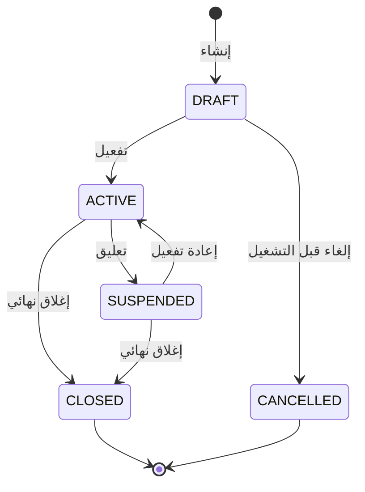
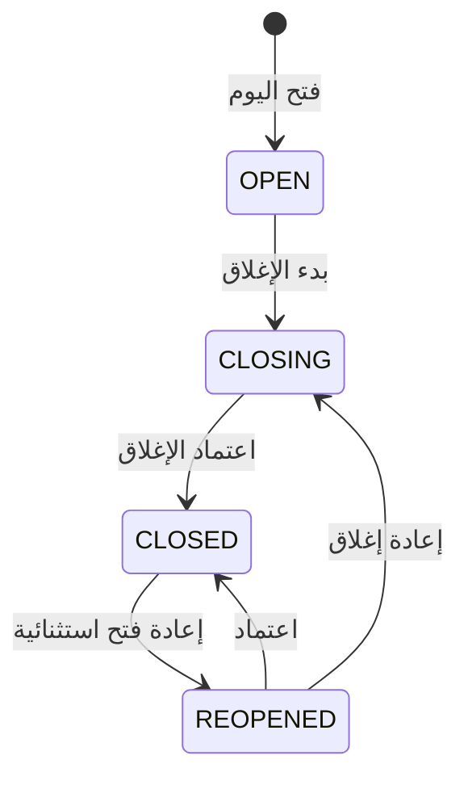
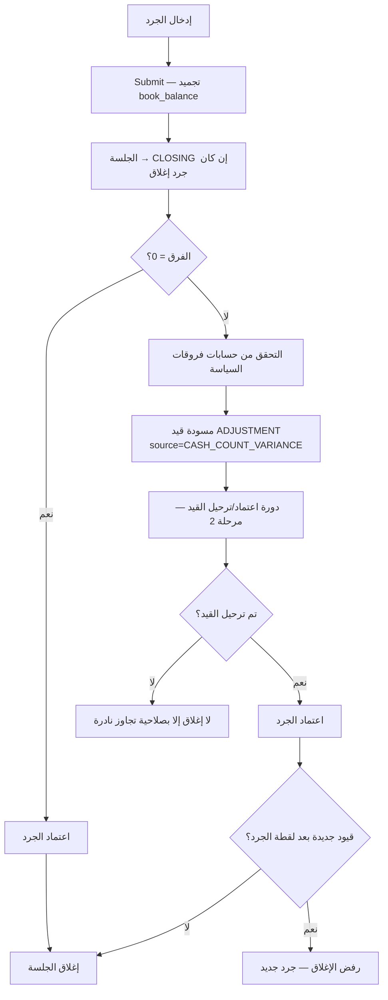

# Cash Management Design Specification  
## مواصفات تصميم إدارة الصناديق — المرحلة 3

### كلية الشرق التقنية التخصصية — منصة systimit / نظام الحسابات

| الحقل | القيمة |
|--------|--------|
| **الوثيقة** | Cash Management Design Specification |
| **الإصدار** | **1.1** (بعد Design Review) |
| **التاريخ** | 12 تموز 2026 |
| **الحالة** | مرجع رسمي معتمد **قبل** بدء التنفيذ · ضمن Baseline `accounting-engine-v1` |
| **المرجعية العليا** | [`docs/accounts-erp-architecture.md`](./accounts-erp-architecture.md) الإصدار 2.0 |
| **المرحلة في Roadmap** | المرحلة 3 — الصناديق |
| **السابقة** | v1.0 اعتمدت كمرجع أولي؛ v1.1 تدمج نتائج Design Review |
| **النطاق** | تصميم فقط في مهمة المراجعة — بلا كود · بلا Migration · بلا APIs |

هذه الوثيقة هي **المرجع الرسمي لوحدة الصناديق**. أي تنفيذ لاحق يجب أن يلتزم بها أو يحدّثها بقرار صريح قبل المخالفة.

---

## فهرس المحتويات

1. الهدف من الوحدة  
2. دور الصندوق داخل النظام  
3. أنواع الصناديق  
4. العلاقة مع دليل الحسابات  
5. العلاقة مع القيود المحاسبية  
6. دورة حياة الصندوق  
7. قواعد العمل (Business Rules)  
8. أنواع الحركات  
9. إدارة الرصيد  
10. الجرد والتسوية  
11. الإغلاق اليومي  
12. إعادة فتح الصندوق  
13. صلاحيات المستخدمين  
14. التقارير  
15. السيناريوهات التشغيلية  
16. تصميم قاعدة البيانات المقترح  
17. تصميم APIs المقترحة  
18. تصميم واجهات المستخدم  
19. حالات الخطأ والاستثناءات  
20. خطة التنفيذ المرحلية  
21. حدود المرحلة 3 وما يخرج عنها  
22. الاعتماد على Shared Services  
23. قرارات تصميم ملزمة  
24. إدارة الوثيقة  
25. ملحق Design Review (نتائج المراجعة المعمارية)  

---

## 1. الهدف من الوحدة

تمكين الكلية من إدارة **الصناديق النقدية** ككيانات تشغيلية مرتبطة بالدفتر المحاسبي، بحيث يمكن:

- تعريف صناديق متعددة (رئيسي، أقساط، نثري، فرعي…).
- ربط كل صندوق بحساب تفصيلي في دليل الحسابات.
- تعيين أمين صندوق ومراقب.
- فتح/إغلاق يوم تشغيلي.
- جرد نقدي فعلي ومقارنة بالرصيد الدفتري.
- تسجيل فروقات الجرد بطريقة محاسبية منضبطة (عبر القيود لاحقاً أو مسودة قيد).
- تهيئة البنية لاستقبال **سندات القبض/الصرف والتحويلات** في المراحل 7–9 دون إعادة تصميم.

**ليست** هدفاً لهذه المرحلة: تشغيل سندات القبض/الصرف، البنوك، الجهات المالية، الأرصدة الافتتاحية الشاملة، أو تقارير القوائم المالية.

---

## 2. دور الصندوق داخل النظام

الصندوق طبقة **تشغيل نقدي** فوق الحساب المحاسبي، وليست بديلاً عن دليل الحسابات أو محرك القيود.


| المفهوم | الدور |
|---------|--------|
| حساب الدليل | التصنيف المحاسبي والرصيد الدفتري |
| الصندوق | الهوية التشغيلية، الأمين، الحدود، الجلسة اليومية |
| القيد المرحّل | مصدر الحقيقة المالية الوحيد للرصيد الدفتري |
| السند (لاحق) | مستند مصدر يحرّك الصندوق ويولّد قيداً |

**مبدأ حاكم (من الوثيقة المعمارية):** لا يُنشأ دفتر أرصدة موازٍ داخل جدول الصناديق يتعارض مع القيود المرحلة.

---

## 3. أنواع الصناديق

أنواع منطقية للكلية (متوافقة مع شجرة الحسابات الحالية تحت `1110 النقدية`):

| الرمز | النوع | الغرض التشغيلي | حساب نموذجي في الدليل |
|-------|--------|----------------|------------------------|
| `MAIN` | الصندوق الرئيسي | النقد العام للإدارة المالية | `1111` |
| `FEES` | صندوق الأقساط | تحصيل أقساط الطلبة (نقداً) | `1112` |
| `PETTY` | صندوق المصروفات النثرية | مصروفات صغيرة بسقف محدد | `1113` |
| `SUB` | صندوق فرعي | أقسام/مواقع/لجان | `1114` (تفصيلي في الـ seed الحالي) أو حسابات تفصيلية إضافية لاحقاً |
| `OTHER` | أخرى | حالات استثنائية بموافقة إدارة الحسابات | حساب تفصيلي يُحدَّد عند الإنشاء |

**قواعد التصنيف:**
- النوع وصفي وتشغيلي؛ **الإلزام المحاسبي** يأتي من ربط `account_id`.
- يجوز أكثر من صندوق من نوع `SUB` / `OTHER`؛ كل منها بحساب تفصيلي مستقل.
- **سياسة موصى بها (قابلة للتهيئة):** صندوق واحد فقط بحالة ACTIVE لكل من `MAIN` و`FEES` و`PETTY` ما لم تُفتح سياسة تعدد صراحةً.
- لا يُسمح بصندوق بلا نوع.

---

## 4. العلاقة مع دليل الحسابات

### 4.1 الربط الإلزامي
- كل صندوق **فعّال** يجب أن يرتبط بحساب واحد في `accounts.chart_of_accounts`.
- الحساب يجب أن يكون:
  - تفصيلياً (`is_group = false`)
  - قابلاً للترحيل (`allow_posting = true`)
  - فعّالاً (`is_active = true`)
  - من نوع **ASSET**
  - ضمن فرع النقدية/ما في حكمها (تحقق منطقي بالكود أو بعلم `cash_account` لاحقاً؛ في v1: تحقق يدوي + قواعد خادم: ASSET + allow_posting)

### 4.2 تفرّد الربط وتحرير الحساب
- **حساب واحد ↔ صندوق واحد** طالما الصندوق في: `DRAFT` | `ACTIVE` | `SUSPENDED`.
- عند `CANCELLED`: يُحرَّر الحساب فوراً.
- عند `CLOSED`: **يُحرَّر الحساب** بعد فك الربط التشغيلي (يُحفظ `account_id` تاريخياً في حقل `closed_account_id` أو تُصفَّر `account_id` مع حفظ اللقطة في سجل الإغلاق) حتى لا يُحبس الحساب إلى الأبد — قرار v1.1 بعد المراجعة.
- يمنع ازدواجية الرصيد التشغيلي على نفس الحساب للصناديق الحية.

### 4.3 ما لا يفعله الصندوق
- لا يغيّر `normal_balance` أو شجرة الحساب.
- لا يرحّل مباشرة على حساب تجميعي مثل `1110` أو `1100`.

### 4.4 توافق مع الشجرة الحالية
الحسابات الجاهزة من Seed المرحلة 1:

| كود | اسم | استخدام مقترح |
|-----|-----|----------------|
| 1111 | الصندوق الرئيسي | MAIN |
| 1112 | صندوق الأقساط | FEES |
| 1113 | صندوق المصروفات النثرية | PETTY |
| 1114 | صناديق فرعية | **تفصيلي وقابل للترحيل في Seed الحالي** → يُربط بصندوق SUB أول؛ أي فرعي إضافي يحتاج حساباً تفصيلياً جديداً تحت `1110` عبر دليل الحسابات |

> وحدة الصناديق **لا تنشئ** حسابات دليل تلقائياً؛ تختار من الحسابات المؤهلة فقط.

---

## 5. العلاقة مع القيود المحاسبية

### 5.1 مصدر الحقيقة
الرصيد الدفتري للصندوق في أي لحظة =

```text
مجموع (مدين − دائن) لسطور القيود
WHERE account_id = صندوق.account_id
  AND journal_entries.status = 'POSTED'
```

(مع احترام إشارة حساب الأصل: مدين يزيد النقد).

### 5.2 كيف تصل الحركات إلى الدفتر؟
| المرحلة | الآلية |
|---------|--------|
| الآن (تصميم المرحلة 3) | لا سندات بعد؛ الرصيد غالباً صفر حتى الافتتاحي/السندات |
| المرحلة 6 | أرصدة افتتاحية → قيود OPENING على حساب الصندوق |
| المراحل 7–9 | سند قبض/صرف/تحويل → قيد تلقائي + `source_type/source_id` |
| استثناء منضبط | قيد يدوي/تسوية مرتبط بجلسة جرد (ADJUSTMENT) عند اعتماد فرق الجرد |

### 5.3 ربط قيد تسوية الجرد (إلزامي عند الأتمتة)
عند اعتماد جرد بفرق ≠ 0 وإنشاء قيد تسوية:
- `entry_type = ADJUSTMENT`
- `source_type = CASH_COUNT_VARIANCE`
- `source_id = cash_counts.id`  
  (يستفيد من الفهرس الفريد الجزئي في 061 ويمنع تكرار قيد لنفس الجرد)

### 5.4 حسابات المقابل لفروقات الجرد (سياسة نظام — **قبل 3.C**)
يجب تهيئة حسابين تفصيليين قابلين للترحيل (أو حساب واحد بصافي اتجاهين حسب السياسة المحاسبية للكلية):

| الإعداد | الاستخدام |
|---------|-----------|
| `cash_variance_gain_account_id` | عندما الفعلي > الدفتري (زيادة نقد غير مفسّرة محاسبياً) |
| `cash_variance_loss_account_id` | عندما الفعلي < الدفتري (عجز) |

بدون هذه الإعدادات: يُسمح بتوثيق الجرد، **ويُمنع** إنشاء قيد التسوية الآلي وإغلاق اليوم عند وجود فرق (ما لم تُستخدم صلاحية تجاوز استثنائية موثّقة تؤجل التسوية إلى قيد يدوي لاحق — غير موصى بها للإنتاج).

### 5.5 ربط اختياري لاحق
الاستنتاج من `account_id` كافٍ في المرحلة 3؛ `cash_box_id` على الحركة/السند يُضاف في المراحل 7–9.

### 5.6 ما يُمنع
- تحديث رصيد مخزّن في جدول الصندوق كبديل عن القيود.
- ترحيل من شاشة الصندوق يتجاوز دورة القيد (اعتماد/ترحيل) المعتمدة في المرحلة 2.
- تغيير `account_id` للصندوق بعد وجود أي جلسة `OPEN` سابقة (أو أي جلسة على الإطلاق بعد أول تفعيل تشغيلي).

---

## 6. دورة حياة الصندوق

### 6.1 حالات الصندوق (الكيان)



| الحالة | المعنى |
|--------|--------|
| `DRAFT` | معرّف غير جاهز للتشغيل (ناقص أمين/حساب) |
| `ACTIVE` | يعمل ويمكن فتح جلسة يومية |
| `SUSPENDED` | موقف مؤقتاً (لا جلسات جديدة) |
| `CLOSED` | مغلق نهائياً؛ الحساب يبقى في الدليل |
| `CANCELLED` | أُلغي قبل أي تشغيل جوهري |

### 6.2 حالات الجلسة اليومية (Session)



| الحالة | المعنى |
|--------|--------|
| `OPEN` | يوم تشغيلي مفتوح |
| `CLOSING` | جرد إغلاق قُدِّم للاعتماد؛ الجلسة مقفلة تشغيلياً بانتظار اعتماد الجرد/الإغلاق |
| `CLOSED` | يوم مقفل |
| `REOPENED` | أُعيد فتحه بسبب خطأ موثّق |

**قاعدة:** صندوق `ACTIVE` يسمح بجلسة واحدة في (`OPEN` | `CLOSING` | `REOPENED`) في نفس الوقت كحد أقصى (قيد فريد جزئي + قفل معاملة).

**انتقال مُلزِم لـ CLOSING (v1.1):**  
`OPEN`/`REOPENED` → عند **Submit** لجرد من نوع `CLOSING` تصبح الجلسة `CLOSING`.  
لا يُعتمد الإغلاق النهائي إلا بعد `APPROVED` للجرد (أو تجاوز مصرّح).  
إذا رُفض الجرد: تعود الجلسة إلى `OPEN` أو `REOPENED`.

---

## 7. قواعد العمل (Business Rules)

### 7.1 التأسيس
1. الكود فريد بدون حساسية حالة الأحرف.  
2. الاسم العربي إلزامي.  
3. النوع من القائمة المعتمدة.  
4. ربط حساب تفصيلي ASSET قابل للترحيل وفعّال.  
5. لا مشاركة الحساب مع صندوق حي (`DRAFT`/`ACTIVE`/`SUSPENDED`)؛ `CLOSED`/`CANCELLED` يحرّران الحساب وفق 4.2.  
6. تعيين أمين أساسي (`is_primary`) إلزامي قبل `ACTIVE`.  
7. سقف للصندوق النثري (`PETTY`) إلزامي (> 0)؛ اختياري لغيره.  
8. لا تغيير `account_id` بعد أول جلسة تشغيلية.  
9. لا تعليق (`SUSPEND`) أو إغلاق نهائي وجلسة في `OPEN`/`CLOSING`/`REOPENED` — أغلق أو ألغِ الجلسة أولاً.

### 7.2 التشغيل اليومي
10. لا حركة تشغيلية على صندوق غير `ACTIVE`.  
11. فتح الجلسة يتطلب عدم وجود جلسة غير مغلقة أخرى لنفس الصندوق (بما فيها `CLOSING`).  
12. `fiscal_year_id` و`fiscal_period_id` و`session_date` **إلزامية**؛ السنة ACTIVE؛ الفترة OPEN؛ والتاريخ داخل حدود الفترة.  
13. الإغلاق يتطلّب جرد إغلاق `APPROVED` أو صلاحية `cashbox.count.bypass` الموثّقة (استثناء إنتاجي نادر).  
14. فتح الجلسة وتغيير حالتها داخل Transaction مع قفل الصندوق (`FOR UPDATE` على `cash_boxes` أو جلسته).

### 7.3 الرصيد والجرد
15. الرصيد الدفتري يُحسب من القيود المرحلة فقط.  
16. عند **Submit** الجرد تُجمَّد لقطة `book_balance` في سجل الجرد؛ فرق الاعتماد يُحسب منها لا من رصيد حي لاحق.  
17. إذا وُجدت قيود `POSTED` جديدة على حساب الصندوق **بعد** لقطة الجرد وقبل الإغلاق: يُرفض الإغلاق ويُطلب جرد جديد (سلامة البيانات).  
18. فرق الجرد ≠ 0 لا يُطمس؛ يُسوَّى بقيد عبر حسابات السياسة (5.4) قبل الإغلاق الافتراضي.  
19. لا كميات سالبة في بنود الفئات.  
20. تحذير إن الرصيد الدفتري سالب (غير معتاد لأصل نقدي) دون منع الجرد.

### 7.4 الإغلاق وإعادة الفتح
21. إعادة الفتح: سبب + صلاحية أعلى + Audit.  
22. لا حذف صندوق له جلسات؛ تعطيل/إغلاق فقط.  
23. كل تغيير جوهري في `financial_audit_log`.

### 7.5 تسليم العهدة (Handover)
24. تغيير الأمين الأساسي والصندوق لديه جلسة مفتوحة يتطلب: إما إغلاق اليوم أولاً، أو جرد مفاجئ معتمد + توثيق التسليم (سيناريو س8).

### 7.6 التوافق المعماري
25. لا كسر محرك القيود (المرحلة 2).  
26. المستخدم من JWT فقط.  
27. المبالغ `NUMERIC(18,3)`.

---

## 8. أنواع الحركات

### 8.1 في نطاق المرحلة 3 (مباشر)
| النوع | الوصف | أثر دفتري فوري؟ |
|-------|--------|------------------|
| `SESSION_OPEN` | فتح يوم | لا |
| `SESSION_CLOSE` | إغلاق يوم | لا |
| `SESSION_REOPEN` | إعادة فتح | لا |
| `CASH_COUNT` | جرد فعلي | لا (حتى اعتماد التسوية) |
| `COUNT_VARIANCE_POST` | اعتماد فرق الجرد | نعم عبر قيد ADJUSTMENT |
| `STATUS_CHANGE` | تفعيل/تعليق/إغلاق كيان | لا |
| `CUSTODIAN_CHANGE` | تغيير الأمين | لا |

### 8.2 خارج المرحلة 3 (مستقبلي — يُصمَّم التوافق فقط)
| النوع | المرحلة | الوصف |
|-------|---------|--------|
| `RECEIPT` | 7 | سند قبض يزيد الصندوق |
| `PAYMENT` | 8 | سند صرف ينقص الصندوق |
| `TRANSFER_IN` / `TRANSFER_OUT` | 9 | تحويل بين صناديق/بنوك |
| `OPENING_BALANCE` | 6 | رصيد افتتاحي |
| `SALARY_PAYMENT` | 16 | صرف رواتب من صندوق/بنك |
| `STUDENT_FEE_CASH` | 15 | تحصيل أقساط نقداً |

**عقد مستقبلي موحّد للحركة النقدية (Logical):**
`cash_box_id` + `direction(IN/OUT)` + `amount` + `source_type` + `source_id` + `journal_entry_id?` + `session_id?`

المرحلة 3 تنشئ الهيكل والمفاهيم؛ جدول حركات نقدية كامل قد يُؤجَّل إلى المرحلة 7 مع الإبقاء على جلسات/جرد الآن.

---

## 9. إدارة الرصيد

### 9.1 تعريفات
| المصطلح | التعريف |
|---------|---------|
| **الرصيد الدفتري (Book)** | من القيود المرحلة على حساب الصندوق |
| **الرصيد الفعلي (Physical)** | مجموع فئات الجرد في الجلسة |
| **الفرق (Variance)** | فعلي − دفتري |
| **الرصيد المتاح تشغيلياً** | في المرحلة 3 = الدفتري؛ لاحقاً يخصم المعلّق غير المرحّل إن وُجد |

### 9.2 سياسة التخزين
- **لا** يُخزَّن `current_balance` كمصدر حقيقة.  
- يُسمح بـ **قيمة مخزّنة مشتقة اختيارية** (`cached_book_balance`) تُحدَّث عند الترحيل/العكس لأغراض العرض فقط، مع إمكانية إعادة الاحتساب في أي وقت.  
- **التوصية للمرحلة 3:** الاحتساب الحي من القيود (أداء مقبول لعدد صناديق قليل)؛ إضافة cache في مرحلة السندات إن لزم.

### 9.3 الرصيد الافتتاحي
- لا يُدخل من شاشة الصندوق كحقل حرّ يكتب الرصيد.  
- المسار المعتمد: المرحلة 6 (قيود افتتاحية) أو قيد يدوي معتمد/مرحّل على حساب الصندوق.  
- شاشة الصندوق تعرض الرصيد ولا تنشئه.

### 9.4 السقف (Ceiling)
- للصندوق النثري: منع اقتراح/اعتماد صرف يتجاوز السقف عند وجود سندات (مرحلة 8).  
- في المرحلة 3: السقف يُخزَّن ويُعرض ويُحذَّر عند الجرد إن تجاوز الفعلي السقف بشكل غير منطقي (تحذير وليس بالضرورة منع).

---

## 10. الجرد والتسوية

### 10.1 هدف الجرد
مطابقة النقد الموجود فعلياً مع الرصيد الدفتري في لحظة الإغلاق (أو جرد مفاجئ بصلاحية).

### 10.2 مكونات الجرد
- فئات العملة (مثال: 25000، 10000، 5000، 1000، 500، 250… قابلة للتهيئة).  
- عدد كل فئة.  
- مجموع محسوب تلقائياً.  
- ملاحظات وأمين الجرد والمراجع.

### 10.3 مسار التسوية عند وجود فرق



**اتجاه قيد التسوية:**
- فعلي > دفتري: مدين حساب الصندوق / دائن `cash_variance_gain_account_id`.  
- فعلي < دفتري: مدين `cash_variance_loss_account_id` / دائن حساب الصندوق.  
- إن كان أحد الحسابات يتطلب مركز كلفة: يُؤخذ من `cash_boxes.cost_center_id` أو يُرفض الإنشاء الآلي.

**Idempotency:** اعتماد جرد سبق وأنشئ له قيد بنفس `source_type/source_id` لا ينشئ قيداً ثانياً.

### 10.4 جرد مفاجئ
- مسموح أثناء `OPEN`/`REOPENED` بصلاحية مراقب.  
- لا ينقل الجلسة إلى `CLOSING` ولا يغلقها تلقائياً.

---

## 11. الإغلاق اليومي

### 11.1 الشروط
1. الصندوق `ACTIVE`.  
2. جلسة بحالة `CLOSING` (بعد Submit جرد إغلاق) — أو مسار تجاوز نادر موثّق.  
3. جرد إغلاق `APPROVED`.  
4. لا قيد تسوية معلّق إلزامي (فرق ≠ 0 دون قيد مرحّل).  
5. لا قيود `POSTED` على حساب الصندوق بعد `book_balance` المجمّد في الجرد.  
6. صلاحية إغلاق وفق المصفوفة.

### 11.2 بيانات الإغلاق المحفوظة
- وقت الإغلاق والمستخدم.  
- الرصيد الدفتري عند الفتح وعند الإغلاق (لقطات).  
- الرصيد الفعلي المعتمد والفرق.  
- مرجع قيد التسوية / مرجع الجرد المعتمد.  
- ملاحظات.

### 11.3 أثر الإغلاق
- يمنع جرد إغلاق جديد على نفس الجلسة.  
- لاحقاً: يمنع ربط سندات جديدة بتلك الجلسة.  
- لا يقفل حساب الدليل (قفل الفترة منفصل).

---

## 12. إعادة فتح الصندوق

يقصد بها **إعادة فتح الجلسة اليومية** وليس إعادة تفعيل الكيان من `CLOSED`.

### 12.1 متى تُسمح؟
- اكتشاف خطأ جرد/إغلاق في نفس اليوم أو بقرار إداري.  
- الحاجة لإلحاق مستند نسي في نفس الجلسة (بعد وجود السندات).

### 12.2 الضوابط
1. سبب إلزامي (نص).  
2. صلاحية `cashbox.session.reopen` (أعلى من الإغلاق العادي).  
3. تسجيل Audit + لاحقاً Timeline وإشعار.  
4. الحالة تصبح `REOPENED` ثم تُغلق مجدداً بمسار الإغلاق الكامل.  
5. لا إعادة فتح جلسة أقدم من N يوماً دون صلاحية مدير النظام (قيمة N تهيئة؛ مقترح أولي: 3 أيام عمل).

### 12.3 إعادة تفعيل الكيان
- من `SUSPENDED` → `ACTIVE`: صلاحية إدارة.  
- من `CLOSED` → غير مسموح افتراضياً؛ إنشاء صندوق جديد أو قرار استثنائي موثّق يحدّث الوثيقة.

---

## 13. صلاحيات المستخدمين

حالياً النظام يعتمد `ACCOUNTS`. التصميم يضيف **قدرات مستقبلية** دون كسر الدخول الحالي:

| القدرة | الوصف | مقترح الأدوار |
|--------|--------|----------------|
| `cashbox.view` | عرض الصناديق والأرصدة | محاسب، أمين، مراقب، إدارة |
| `cashbox.create` | إنشاء صندوق | إدارة مالية |
| `cashbox.update` | تعديل بيانات غير حرجة | إدارة مالية |
| `cashbox.activate` | تفعيل/تعليق | إدارة مالية |
| `cashbox.close_entity` | إغلاق نهائي | إدارة عليا |
| `cashbox.session.open` | فتح يوم | أمين |
| `cashbox.session.close` | إغلاق يوم | أمين + اعتماد مراقب (اختياري بتهيئة) |
| `cashbox.session.reopen` | إعادة فتح جلسة | مراقب/مدير |
| `cashbox.count` | إدخال جرد | أمين |
| `cashbox.count.approve` | اعتماد جرد/فرق | مراقب |
| `cashbox.count.bypass` | تجاوز جرد/تسوية (نادر) | إدارة عليا فقط |
| `cashbox.reports` | تقارير | محاسب، إدارة |
| `cashbox.settings` | تهيئة حسابات فروقات الجرد | إدارة مالية |

**مرحلة التنفيذ الأولى:** الإبقاء على `requireAccountsAccess` مع تسجيل القدرات في الكود كـ guards جاهزة (نمط `assertJournalCapability`).  
**مرحلة لاحقة:** ربط بجدول صلاحيات أو Approval Engine.

**فصل المهام الموصى به:** من يعتمد فرق الجرد ≠ من يعدّ النقد ما أمكن.

---

## 14. التقارير

| التقرير | المحتوى | أولوية المرحلة 3 |
|---------|---------|-------------------|
| قائمة الصناديق | النوع، الحساب، الأمين، الحالة، الرصيد الدفتري | عالية |
| جلسة يومية | فتح/إغلاق، أرصدة، فرق | عالية |
| فروقات الجرد | التاريخ، الصندوق، الفرق، قيد التسوية | عالية |
| حركة الصندوق | لاحقاً من السندات+القيود | تصميم فقط الآن |
| أرصدة الصناديق بتاريخ | لقطة دفترية | متوسطة |
| تجاوزات السقف | للصناديق النثرية | منخفضة حتى السندات |

التصدير والطباعة: عبر Export/Printing Engines عند توفرهما؛ مؤقتاً جداول شاشة + CSV لاحق ضمن الوحدة إن لزم.

---

## 15. السيناريوهات التشغيلية

### س1 — تأسيس صندوق الأقساط
1. التأكد من وجود حساب `1112` تفصيلي فعّال.  
2. إنشاء صندوق نوع FEES مربوط بـ 1112.  
3. تعيين أمين.  
4. تفعيل الصندوق.  
5. فتح جلسة اليوم (رصيد دفتري 0 حتى الافتتاحي/التحصيل).

### س2 — يوم عمل بدون حركة محاسبية بعد
1. فتح جلسة.  
2. لا سندات بعد في المرحلة 3.  
3. جرد = 0 إن لم يدخل نقد.  
4. إغلاق بلا فرق.

### س3 — بعد وجود رصيد دفتري (مرحلة 6+)
1. فتح جلسة.  
2. جرد يظهر فرقاً بـ 5,000.  
3. إنشاء مسودة تسوية → اعتماد → ترحيل.  
4. إعادة احتساب الدفتري = الفعلي.  
5. إغلاق.

### س4 — خطأ إغلاق
1. جلسة CLOSED.  
2. إعادة فتح بسبب «نقص فئة في العد».  
3. تعديل الجرد.  
4. إغلاق مجدد.

### س5 — تعليق صندوق فرعي
1. لا جلسة مفتوحة (أو تُغلق أولاً).  
2. الحالة SUSPENDED.  
3. منع فتح جلسات حتى إعادة التفعيل.

### س6 — محاولة ربط حساب مستخدم
1. رفض مع رسالة: الحساب مرتبط بصندوق آخر.

### س7 — مستقبل: تحصيل قسط نقداً (مرحلة 15/7)
1. سند قبض على صندوق FEES في جلسة OPEN.  
2. قيد تلقائي يزيد 1112.  
3. يظهر في رصيد الصندوق فوراً بعد الترحيل.

### س8 — تسليم عهدة أثناء اليوم
1. جلسة OPEN.  
2. جرد مفاجئ معتمد (لقطة عهدة).  
3. إنهاء صلاحية الأمين القديم + تعيين أمين جديد `is_primary`.  
4. Audit مزدوج (جرد + CUSTODIAN_CHANGE).  
5. الجلسة تبقى OPEN باسم العهدة الجديدة.

### س9 — ترحيل قيد أثناء CLOSING
1. جرد إغلاق Submitted ولقطة book مجمّدة.  
2. مستخدم آخر يرحّل قيداً يمس حساب الصندوق.  
3. عند محاولة الإغلاق: رفض 409 وطلب جرد جديد.

### س10 — يومان متتاليان بلا إغلاق أمس
1. محاولة فتح جلسة بتاريخ اليوم وجلسة أمس ما زالت OPEN/CLOSING.  
2. رفض حتى إغلاق/معالجة الجلسة السابقة (لا جلستين حيتين).

---

## 16. تصميم قاعدة البيانات المقترح

> تصميم منطقي للمرحلة 3. الأرقام النهائية للـ Migration عند التنفيذ (مرشّح: **062**…). لا تُنفَّذ هنا.

### 16.0 إعدادات فروقات الجرد
تُخزَّن في إعدادات الحسابات (جدول إعدادات قائم أو مفتاح/قيمة مرتبط بالنظام)، وليست أعمدة على كل صندوق:
- `cash_variance_gain_account_id`
- `cash_variance_loss_account_id`

### 16.1 `accounts.cash_boxes`
| الحقل | النوع | ملاحظات |
|-------|--------|---------|
| id | UUID PK | |
| code | VARCHAR | فريد LOWER(code) |
| name_ar | VARCHAR | إلزامي |
| name_en | VARCHAR NULL | |
| box_type | VARCHAR | MAIN/FEES/PETTY/SUB/OTHER |
| account_id | UUID NULL | FK؛ NULL بعد CLOSED إن فُك الربط |
| closed_account_id | UUID NULL | لقطة الحساب عند الإغلاق النهائي |
| cost_center_id | UUID NULL | اختياري؛ يُستخدم لتسوية الجرد إن لزم |
| status | VARCHAR | DRAFT/ACTIVE/SUSPENDED/CLOSED/CANCELLED |
| ceiling_amount | NUMERIC(18,3) NULL | إلزامي لـ PETTY و > 0 |
| currency_code | VARCHAR | IQD في المرحلة 3 |
| location_note | TEXT NULL | |
| description | TEXT NULL | |
| opened_at / closed_at | DATE NULL | |
| created_by / updated_by | UUID | |
| created_at / updated_at | TIMESTAMPTZ | |
| version | INT | |

**فهارس:** UNIQUE(LOWER(code))؛ **UNIQUE(account_id) WHERE account_id IS NOT NULL AND status IN ('DRAFT','ACTIVE','SUSPENDED')**؛ index(status)، index(box_type).

### 16.2 `accounts.cash_box_custodians`
| الحقل | ملاحظات |
|-------|---------|
| id | PK |
| cash_box_id | FK |
| user_id | FK users |
| role | CUSTODIAN / SUPERVISOR |
| valid_from / valid_to | فترة التعيين |
| is_primary | أمين أساسي |
| created_by, timestamps | |

قيد فريد جزئي: أمين أساسي واحد ساري (`valid_to IS NULL` أو > الآن) لكل صندوق.

### 16.3 `accounts.cash_box_sessions`
| الحقل | ملاحظات |
|-------|---------|
| id | PK |
| cash_box_id | FK |
| fiscal_year_id | **إلزامي** FK |
| fiscal_period_id | **إلزامي** FK |
| session_date | DATE إلزامي |
| status | OPEN/CLOSING/CLOSED/REOPENED |
| opened_by / opened_at | |
| closed_by / closed_at | NULL حتى الإغلاق |
| reopen_reason | NULL |
| reopen_count | INT افتراضي 0 |
| book_balance_at_open | لقطة |
| book_balance_at_close | لقطة |
| physical_balance_at_close | |
| variance_amount | |
| closing_count_id | FK NULL للجرد المعتمد |
| variance_journal_entry_id | FK NULL |
| notes | |
| version | |

قيد فريد جزئي: جلسة واحدة بحالة IN ('OPEN','CLOSING','REOPENED') لكل `cash_box_id`.

### 16.4 `accounts.cash_denominations` (اختياري تهيئة)
فئات العملة للعدّ (قيمة الوجه، ترتيب العرض، نشط).

### 16.5 `accounts.cash_counts`
| الحقل | ملاحظات |
|-------|---------|
| id | PK |
| session_id | FK |
| cash_box_id | FK (إ冗余 مقبول للتقارير) |
| count_type | CLOSING / SURPRISE |
| status | DRAFT / SUBMITTED / APPROVED / REJECTED |
| book_balance | لقطة عند الجرد |
| physical_total | |
| variance_amount | |
| counted_by / approved_by | |
| counted_at / approved_at | |
| notes / rejection_reason | |

### 16.6 `accounts.cash_count_lines`
| الحقل | ملاحظات |
|-------|---------|
| count_id | FK CASCADE |
| denomination_id أو face_value | |
| quantity | INT >= 0 |
| line_total | NUMERIC مولَّد/محسوب |

### 16.7 ما يُؤجَّل
- جدول `cash_movements` الكامل → مع السندات (7–9).  
- ربط صريح سطر القيد بالصندوق → عند الحاجة الأدائية.

---

## 17. تصميم APIs المقترحة

القاعدة: `/api/accounts/cash-boxes`… الحماية `requireAccountsAccess` + guards القدرات لاحقاً.

| الطريقة | المسار | الغرض |
|---------|--------|--------|
| GET | `/cash-boxes` | قائمة + فلاتر + أرصدة دفترية |
| POST | `/cash-boxes` | إنشاء DRAFT/ACTIVE |
| GET | `/cash-boxes/{id}` | تفاصيل + أمين + جلسة حالية |
| PUT | `/cash-boxes/{id}` | تعديل مع version |
| POST | `/cash-boxes/{id}/activate` | تفعيل |
| POST | `/cash-boxes/{id}/suspend` | تعليق |
| POST | `/cash-boxes/{id}/close` | إغلاق نهائي |
| GET/PUT | `/cash-boxes/{id}/custodians` | إدارة الأمناء |
| GET | `/cash-boxes/{id}/sessions` | تاريخ الجلسات |
| POST | `/cash-boxes/{id}/sessions/open` | فتح يوم |
| POST | `/cash-boxes/{id}/sessions/{sid}/close` | إغلاق يوم |
| POST | `/cash-boxes/{id}/sessions/{sid}/reopen` | إعادة فتح |
| POST | `/cash-boxes/{id}/sessions/{sid}/counts` | إنشاء جرد |
| PUT | `/counts/{id}` | تعديل مسودة جرد |
| POST | `/counts/{id}/submit` | إرسال للاعتماد |
| POST | `/counts/{id}/approve` | اعتماد (+ إنشاء مسودة تسوية عند الفرق) |
| GET | `/cash-boxes/reports/summary` | تقرير أرصدة |
| GET | `/cash-boxes/options` | حسابات مؤهلة، فئات، أنواع |

**استجابات الأخطاء:** نفس سياسة النظام (400/401/403/404/409/500) ورسائل عربية.

---

## 18. تصميم واجهات المستخدم

### 18.1 المسارات المقترحة
| المسار | الوظيفة |
|--------|---------|
| `/accounts/cashbox` | قائمة الصناديق (استبدال الـ placeholder) |
| `/accounts/cashbox/[id]` | تفاصيل الصندوق |
| `/accounts/cashbox/[id]/session` | الجلسة اليومية الحالية |
| `/accounts/cashbox/reports` | تقارير الصناديق |

الخزينة `/accounts/treasury` تُترك للبنوك (المرحلة 4) أو تُوضَّح كرابط للبنوك لاحقاً لتجنب الخلط.

### 18.2 شاشة القائمة
- بطاقات: عدد الصناديق، المفتوحة اليوم، فروقات معلّقة.  
- جدول: الكود، الاسم، النوع، الحساب، الأمين، الحالة، الرصيد الدفتري، جلسة اليوم.  
- زر «صندوق جديد».

### 18.3 شاشة التفاصيل
- بيانات الصندوق + الحساب المرتبط (رابط لدليل الحسابات).  
- الأمناء.  
- زر فتح/إغلاق الجلسة حسب الحالة.  
- آخر الجلسات والفروقات.  
- Timeline لاحقاً.

### 18.4 شاشة الجلسة والجرد
- عرض الرصيد الدفتري الحي.  
- جدول فئات العملة والكميات.  
- مجموع فعلي، فرق بلون تحذيري.  
- مسار اعتماد الفرق.  
- تأكيدات قبل الإغلاق وإعادة الفتح.

### 18.5 مبادئ UI
- RTL، هوية الحسابات الحالية، تحميل وEmpty State.  
- مكوّنات منفصلة تحت `app/accounts/cashbox/components/`.  
- لا منطق ترحيل محاسبي في الواجهة؛ عبر API فقط.

---

## 19. حالات الخطأ والاستثناءات

| الحالة | رمز مقترح | رسالة مفاهيمية |
|--------|-----------|----------------|
| كود مكرر | 409 | رمز الصندوق مستخدم |
| حساب غير تفصيلي/غير ASSET | 400/409 | لا يمكن ربط هذا الحساب بصندوق |
| حساب مستخدم لصندوق آخر | 409 | الحساب مرتبط بصندوق قائم |
| تفعيل بلا أمين | 409 | عيّن أميناً قبل التفعيل |
| فتح جلسة والصندوق غير ACTIVE | 409 | الصندوق غير نشط |
| جلسة مفتوحة مسبقاً | 409 | يوجد يوم مفتوح |
| إغلاق بلا جرد معتمد | 409 | اعتمد الجرد أولاً |
| إعادة فتح بلا سبب | 400 | السبب مطلوب |
| تعارض version | 409 | عُدِّل السجل من مستخدم آخر |
| فرق جرد بلا تسوية ملزمة | 409 | سوِّ الفرق أو اطلب صلاحية التجاوز |
| حسابات فروقات غير مهيأة | 409 | اضبط حسابات فروقات الجرد أولاً |
| نشاط دفتري بعد لقطة الجرد | 409 | أعد الجرد قبل الإغلاق |
| فترة/سنة غير صالحة | 409 | نفس قواعد القيود |
| تعليق وجلسة حية | 409 | أغلق الجلسة أولاً |
| محاولة حذف صندوق له جلسات | 409 | أغلقه بدلاً من الحذف |
| غير مصرّح | 401/403 | سياسات الدخول الحالية |

---

## 20. خطة التنفيذ المرحلية (داخل المرحلة 3)

> ترتيب v1.1 بعد المراجعة: **لا إغلاق بلا جرد** حتى في الدفعات المبكرة.

| دفعة | المحتوى | مخرجات قبول |
|-------|---------|--------------|
| **3.A** | Migration الصناديق + الأمناء + إعدادات فروقات الجرد (مفاتيح) + CRUD + قائمة/تفاصيل | إنشاء، ربط حساب، أمين، تفعيل؛ تهيئة حسابات الفروقات اختيارية هنا وإلزامية قبل 3.C |
| **3.B** | الجلسات: فتح + لقطات + جرد إغلاق مبسّط (فئة واحدة/مبلغ إجمالي مسموح مؤقتاً) + CLOSING + إغلاق بفرق صفر فقط | جلسة واحدة حية؛ إغلاق بجرد معتمد وفرق 0؛ منع جلستين |
| **3.C** | فئات العملة + جرد مفصّل + فرق ≠ 0 + مسودة/ترحيل قيد `CASH_COUNT_VARIANCE` + فحص نشاط بعد اللقطة | س3 + س9 |
| **3.D** | إعادة الفتح + تعليق/إغلاق نهائي + تسليم عهدة + Audit كامل | س4، س5، س8 |
| **3.E** | التقارير + options + توثيق عقد الحركات المستقبلية | تقارير أساسية |

**اختبارات قبول دنيا:** تفرّد الحساب الحي، منع جلستين حيتين، رصيد من قيد مرحّل، مسار فرق الجرد، رفض إغلاق بعد ترحيل لاحق، 401، version 409، عدم كسر قيود المرحلة 2.
---

## 21. حدود المرحلة 3 وما يخرج عنها

| داخل النطاق | خارج النطاق (مراحل لاحقة) |
|-------------|---------------------------|
| كيان الصندوق والربط المحاسبي | البنوك |
| الأمناء والجلسات | الجهات Customers/Vendors |
| الجرد والتسوية عبر قيد | سندات القبض/الصرف |
| التقارير الأساسية | التحويلات |
| تهيئة السقف والصلاحيات المفاهيمية | الأرصدة الافتتاحية الشاملة |
| | أقساط/رواتب تلقائية |
| | مطابقة بنكية |

---

## 22. الاعتماد على Shared Services

| الخدمة | استخدام المرحلة 3 | التوقيت |
|--------|-------------------|---------|
| Audit الحالي | إلزامي فوراً | مع 3.A |
| Notification | إشعار فرق جرد / إعادة فتح | يُفضَّل 3.D أو بعده مباشرة |
| Activity Timeline | عرض دورة الجلسة للمستخدم | بعد توفر الخدمة |
| Attachment | صور محضر الجرد | اختياري 3.C+ |
| Approval Engine | اعتماد جرد متعدد المستويات | لاحقاً؛ مسار بسيط الآن |
| Export / Printing | كشف جرد وجلسة | لاحقاً |
| Reporting Engine | توحيد تقارير الصناديق | عند نضج المحرك |

---

## 23. قرارات تصميم ملزمة

1. الصندوق لا يستبدل حساب الدليل.  
2. الرصيد الدفتري من القيود المرحلة فقط.  
3. لا سندات في تنفيذ المرحلة 3؛ فقط تهيئة العقود.  
4. جلسة حية واحدة لكل صندوق (`OPEN`/`CLOSING`/`REOPENED`).  
5. فرق الجرد لا يُخفى؛ يُسوَّى عبر حسابات السياسة + `source_type=CASH_COUNT_VARIANCE`.  
6. لقطة `book_balance` عند Submit الجرد؛ رفض إغلاق إن تغيّر الدفتر بعدها.  
7. إعادة الفتح صلاحية أعلى + سبب.  
8. تفرّد ربط الحساب للصناديق الحية؛ التحرير عند CLOSED/CANCELLED.  
9. PETTY يتطلب سقفاً > 0.  
10. السنة/الفترة إلزاميتان على الجلسة.  
11. الالتزام بمعايير الوثيقة المعمارية 2.0.  
12. `/accounts/treasury` للبنوك لاحقاً وليس بديلاً عن الصناديق.

---

## 24. إدارة الوثيقة

| البند | القاعدة |
|-------|---------|
| الاعتماد | **v1.1** مرجع رسمي جاهز للتنفيذ بعد Design Review |
| التعديل | أي تغيير على دورة الجلسة أو سياسة الرصيد يتطلّب إصدار جديد |
| التنفيذ | يُسمح بالبدء بـ **3.A** بعد أمر تنفيذ صريح |
| التتبع | بعد التنفيذ: إضافة رقم Migration في الوثيقة المعمارية |

---

## 25. ملحق Design Review (نتائج المراجعة المعمارية)

مراجعة Lead Architect لـ v1.0 مقابل ERP Architecture 2.0 — ملخص القرارات المدمجة أعلاه.

### 25.1 إجابات موجزة على أسئلة المراجعة

| # | السؤال | الخلاصة |
|---|--------|---------|
| 1 | تعارض مع المعمارية؟ | لا تعارض جوهري؛ الرصيد من POSTED متوافق. ثغرات: حسابات الفروقات، تحرير الحساب عند CLOSED، إلزام الفترة. |
| 2 | قواعد ناقصة؟ | نعم — سُدّت في v1.1 (لقطة الجرد، handover، منع تغيير الحساب، إعدادات الفروقات). |
| 3 | سيناريوهات ناقصة؟ | س8–س10 أُضيفت. |
| 4 | كفاية DB؟ | كافية بعد تعديل الفهرس الجزئي + إعدادات الفروقات + إلزام السنة/الفترة. |
| 5 | استثناءات؟ | نشاط دفتري أثناء CLOSING؛ تجاوز الجرد نادر. |
| 6 | ترتيب 3.A→3.E؟ | 3.B في v1.0 كان يسمح إغلاقاً بلا جرد — **صُحّح** في v1.1. |
| 7 | خطر إعادة تصميم؟ | جدول `cash_movements` مؤجّل بوعي؛ عقد منطقي كافٍ. حسابات الفروقات كانت أكبر خطر — عُولجت. |
| 8 | أداء؟ | SUM على سطور مرحّلة مقبول لعدد صناديق قليل؛ فهرس `account_id` موجود؛ cache لاحقاً مع السندات. |
| 9 | سلامة بيانات؟ | لقطة الجرد + رفض الإغلاق عند نشاط لاحق + idempotency للقيد. |
| 10 | تعدد مستخدمين؟ | version + قيد فريد جزئي + FOR UPDATE عند فتح/إغلاق. |
| 11 | تدقيق؟ | Audit + source_type للجرد + فصل مهام موصى؛ Timeline/مرفقات لاحقاً. |
| 12 | توسع؟ | نعم مع عقود الحركات والمسارات `/cashbox` vs `/treasury`. |
| 13 | تأجيل؟ | حركات نقدية كاملة، بنوك، عملات متعددة، Approval Engine، إشعارات غنية. |
| 14 | إضافة الآن؟ | حسابات الفروقات، قواعد CLOSING/اللقطة، تحرير الحساب — **أُضيفت في v1.1**. |

### 25.2 سجل الملاحظات حسب الأولوية (وقت المراجعة)

#### Critical (عُولجت في v1.1)
1. حسابا مقابل فرق الجرد غير معرّفين → إعادة تصميم مسار 3.C.  
2. إغلاق 3.B بلا جرد يناقض قاعدة العمل.  
3. تغيّر الرصيد الدفتري بين الجرد والإغلاق دون كشف.  
4. فهرس تفرّد الحساب يحبس الحساب على CLOSED إلى الأبد.

#### High (عُولجت أو مقيّدة)
5. `fiscal_year_id` / `fiscal_period_id` كانا اختياريين.  
6. حالة `CLOSING` بلا انتقال ملزم.  
7. غياب `source_type` ثابت لتسوية الجرد.  
8. تسليم العهدة أثناء جلسة مفتوحة غير مغطى.  
9. منع تغيير `account_id` بعد التشغيل.

#### Medium
10. سياسة «صندوق MAIN/FEES/PETTY واحد نشط» — موصى بها اختيارياً.  
11. رصيد دفتري سالب — تحذير فقط.  
12. Cache رصيد مؤجّل حتى نمو القيود/السندات.  
13. مرفقات محضر الجرد — بعد Attachment Service.  
14. تعدد عملات — خارج المرحلة 3.

#### Low
15. تقارير تجاوز السقف — مع السندات.  
16. إشعارات غنية — بعد Notification Service.  
17. Timeline للجلسة — بعد الخدمة المشتركة.

### 25.3 توصيات نهائية

1. التنفيذ وفق **v1.1** لا v1.0.  
2. ابدأ بـ **3.A** ثم **3.B** كما عُدّل (جرد إلزامي ولو مبسّط).  
3. لا تبدأ 3.C قبل تهيئة حسابات فروقات الجرد في بيئة الكلية.  
4. لا تُنفَّذ سندات أو `cash_movements` الكامل في المرحلة 3.  
5. الوثيقة **جاهزة للتنفيذ** بعد دمج تعديلات هذه المراجعة.

---

## خاتمة

وحدة الصناديق هي **بوابة السيولة النقدية** في الـ ERP المحاسبي للكلية: تربط الحساب التفصيلي بالتشغيل اليومي (أمين، جلسة، جرد) دون إنشاء دفتر موازٍ، وتمهّد لسندات القبض والصرف والتحويلات.

**الحكم:** وثيقة Cash Management Design Specification **v1.1 جاهزة للتنفيذ**.  
**الخطوة التالية:** أمر تنفيذ صريح للدفعة **3.A** فقط.

— نهاية وثيقة Cash Management Design Specification v1.1 —
