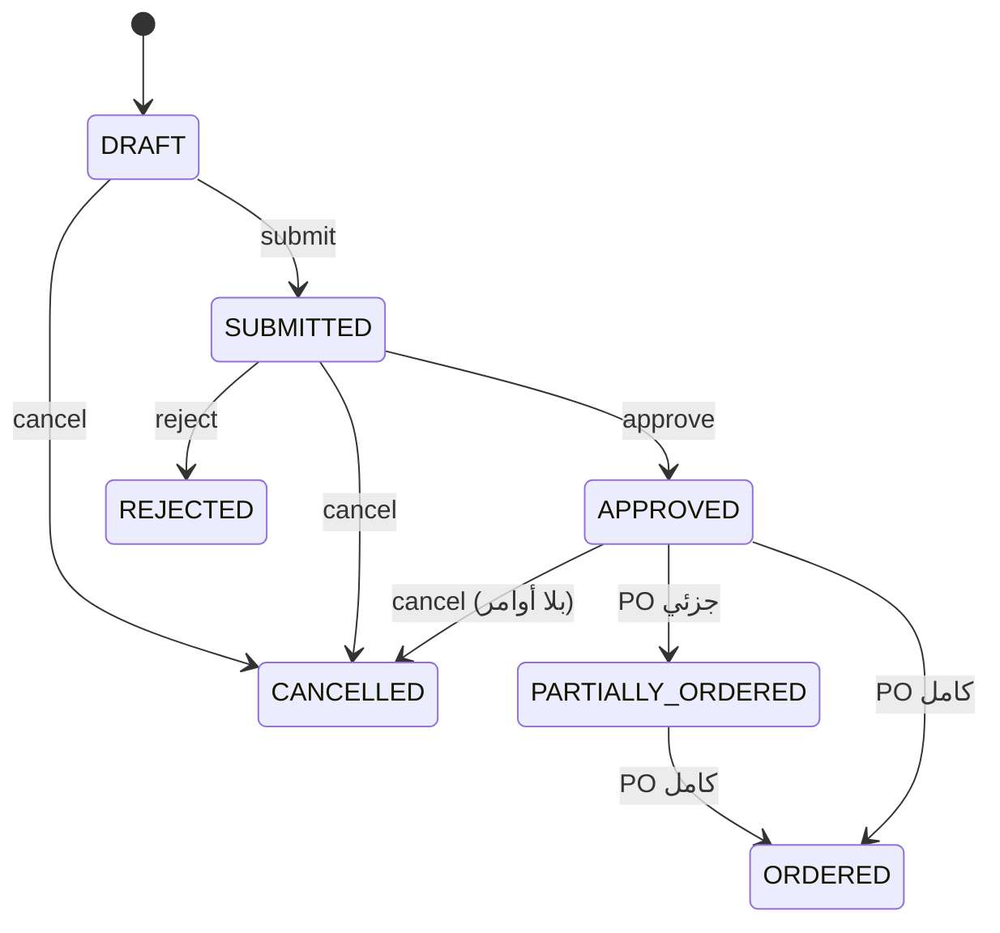
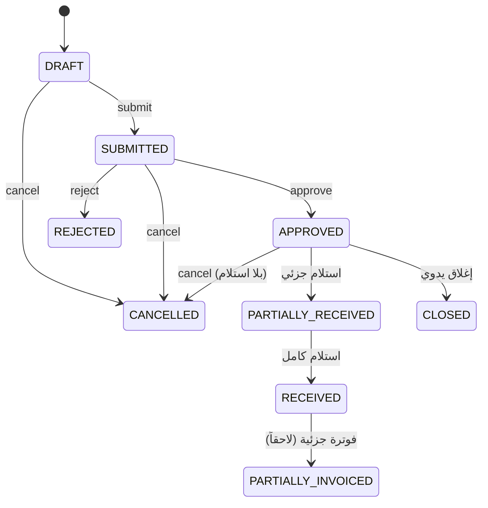
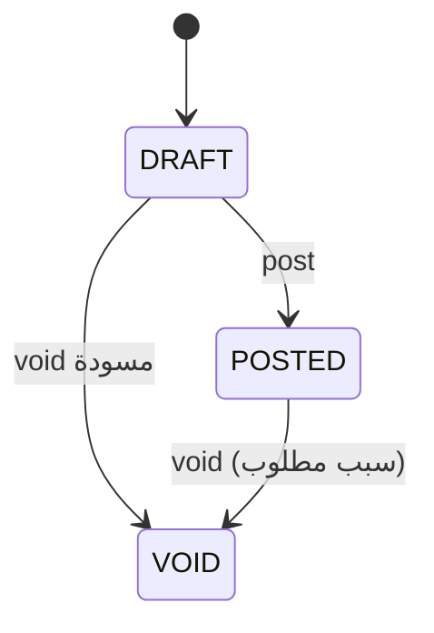

# خطة تنفيذ المشتريات 7.A — خدمات النطاق

## النطاق (Scope)

المرحلة **7.A** تغطي دورة مشتريات **غير مخزنية** (خدمات، مواد غير مخزنة، مرشّحات أصول ثابتة) عبر ثلاثة مستندات:

| المستند | البادئة | الجدول | ترحيل GL |
|---------|---------|--------|----------|
| طلب شراء (PRQ) | `PRQ` | `purchase_requisitions` | لا |
| أمر شراء (POR) | `POR` | `purchase_orders` | لا |
| محضر استلام (PRC) | `PRC` | `purchase_receipts` | لا |

**خارج النطاق في 7.A (مؤجّل):**

- واجهات API وواجهات المستخدم (تُبنى لاحقاً).
- مطابقة فاتورة المورد مع PO/استلام (7.A — matching في `091`).
- قيود يومية عند الاستلام أو الفوترة.
- إدارة مخزون / GRNI / استلام مخزني.

**الملفات المنفّذة:**

- `src/lib/accounts/purchase-requisitions.ts`
- `src/lib/accounts/purchase-orders.ts`
- `src/lib/accounts/purchase-receipts.ts`
- `src/lib/accounts/purchasing-access.ts` (صلاحيات — موجود مسبقاً)

---

## سير العمل (Workflows)

### 1. طلب الشراء (PRQ)

- **إنشاء/تعديل:** مسودة فقط؛ السطور تُستبدَل بالكامل عند التعديل.
- **تقديم:** يتطلب سطراً واحداً على الأقل.
- **اعتماد/رفض:** من `SUBMITTED` فقط؛ الرفض يتطلب سبباً.
- **إلغاء:** من `DRAFT` / `SUBMITTED` / `APPROVED` (إذا لم يُنشأ PO بعد).
- **حالات الكمية:** بعد إنشاء PO تُشتق `PARTIALLY_ORDERED` أو `ORDERED` تلقائياً.

### 2. أمر الشراء (POR)

- **إنشاء مباشر:** سطور مع `expense_gl_account_id` إلزامي.
- **من طلب:** يربط `requisition_line_id` ويزيد `ordered_quantity` على الطلب.
- **اعتماد:** المورد `ACTIVE` فقط؛ حساب المورد ليس `CLOSED`.
- **إلغاء/رفض:** يعكس كميات الطلب المرتبطة إن وُجدت.

### 3. محضر الاستلام (PRC)

- **ترحيل:** يحدّث كميات PO (مستلم/مقبول/مرفوض) ويشتق حالات السطور والرأس.
- **إبطال:** يعكس الكميات؛ يُمنع إذا `invoiced_quantity > accepted_quantity` بعد العكس.

---

## معادلات الكميات (Quantity Equations)

### سطر طلب الشراء

| الحقل | القاعدة |
|-------|---------|
| `estimated_total` | `ROUND(requested_quantity × estimated_unit_price, 3)` |
| `ordered_quantity` | `0 ≤ ordered ≤ requested` |
| **المتبقي للأمر** | `remaining = requested − ordered` |

### سطر أمر الشراء

| الحقل | القاعدة |
|-------|---------|
| `line_total` | `ROUND(qty × price, 3) − discount + tax` |
| `received_quantity` | `≤ ordered − cancelled` |
| `accepted + rejected` | `= received` |
| `invoiced_quantity` | `≤ accepted` |
| **متبقي للاستلام** | `open = ordered − cancelled − received` |

### سطر محضر الاستلام

| الحقل | القاعدة |
|-------|---------|
| `received_quantity` | `> 0` |
| `accepted + rejected` | `= received` |
| عند **POST** | يُضاف إلى PO: `received/accepted/rejected` |
| عند **VOID** | يُطرح من PO؛ يُرفض إذا `invoiced > accepted` بعد العكس |

### اشتقاق حالة سطر PO

1. `open = ordered − cancelled` → إذا `open ≤ 0` → `CANCELLED`
2. `received = 0` → `OPEN`
3. `received < open` → `PARTIALLY_RECEIVED`
4. `invoiced = 0` → `RECEIVED`
5. `invoiced < accepted` → `PARTIALLY_INVOICED`
6. وإلا → `INVOICED`

### اشتقاق حالة رأس PO

من حالات السطور النشطة (غير `CANCELLED`): فوترة ← استلام ← `APPROVED`.

---

## المطابقة والفوترة (Matching — لاحق)

الهجرة `091` تمهّد:

- `supplier_invoices.invoice_source` = `MANUAL` | `PURCHASE_ORDER`
- `supplier_invoice_lines` مع `purchase_order_line_id` / `purchase_receipt_line_id`
- `purchasing_config.price_tolerance_percent` لتسامح السعر

**حدود 7.A الحالية:** لا ترحيل GL عند الاستلام؛ الترحيل المحاسبي يبقى عند **ترحيل فاتورة المورد** (6.A) في مرحلة matching لاحقة.

---

## الحدود المحاسبية (Accounting Boundary)

| الحدث | GL | دفتر مورد |
|-------|-----|-----------|
| PRQ submit/approve | لا | لا |
| PO approve | لا | لا |
| PRC post | **لا** (7.A) | لا |
| فاتورة مورد من PO | Dr Expense / Cr Payables | نعم (6.A+) |

- العملة: **IQD** فقط.
- حساب المصروف: `assertValidExpenseGlAccount` (EXPENSE ترحيلي).
- السياق المالي: `assertFiscalContextForEntry` على التواريخ.
- **لا** `journal_entries` في هذه الخدمات.

---

## الصلاحيات (Permissions)

من `purchasing-access.ts`:

| القدرة | الأدوار |
|--------|---------|
| عرض PRQ/PO/PRC | Viewer+ |
| إعداد/تقديم/إلغاء PRQ | Clerk+ |
| اعتماد/رفض PRQ | Approver+ |
| PO مباشر + إعداد/تقديم | Clerk+ |
| اعتماد/رفض PO | Approver+ |
| إلغاء PO | Admin |
| ترحيل/إبطال PRC | Admin |

التحقق عبر `assertPurchasingCapability` في طبقة API (لم تُنفَّذ بعد).

---

## المخزون المؤجّل (Deferred Inventory)

- `purchase_kind` يتضمن `NON_STOCK_ITEM` و`FIXED_ASSET_CANDIDATE` دون ربط بمخزون.
- الاستلام **إثبات كمي/قبول** على PO فقط؛ لا حركة مخزنية ولا GRNI.
- مرحلة لاحقة (7.B+): مخزون، أصول ثابتة، GRNI، قيود استلام.

---

## التزامن والأقفال

- **Optimistic concurrency:** `version` + `updated_at` عبر `assertCashSessionOptimisticConcurrency`.
- **Advisory locks:** `acquireAccountingResourceLocks` مع `purchaseRequisitionLock` / `purchaseOrderLock` / `purchaseReceiptLock` وموارد المورد عند الاعتماد.
- **تسلسل المستندات:** `nextDocumentNumber` + `FOR UPDATE` على `document_sequences`.

---

## نقاط اختبار

- `setPurchaseReceiptPostFaultForTests('after_po_update')` — فشل بعد تحديث PO وقبل `POSTED` على المحضر.
- عكس كميات الطلب عند إلغاء/رفض PO المرتبط.
- منع void محضر إذا الفوترة تتجاوز المقبول بعد العكس.
